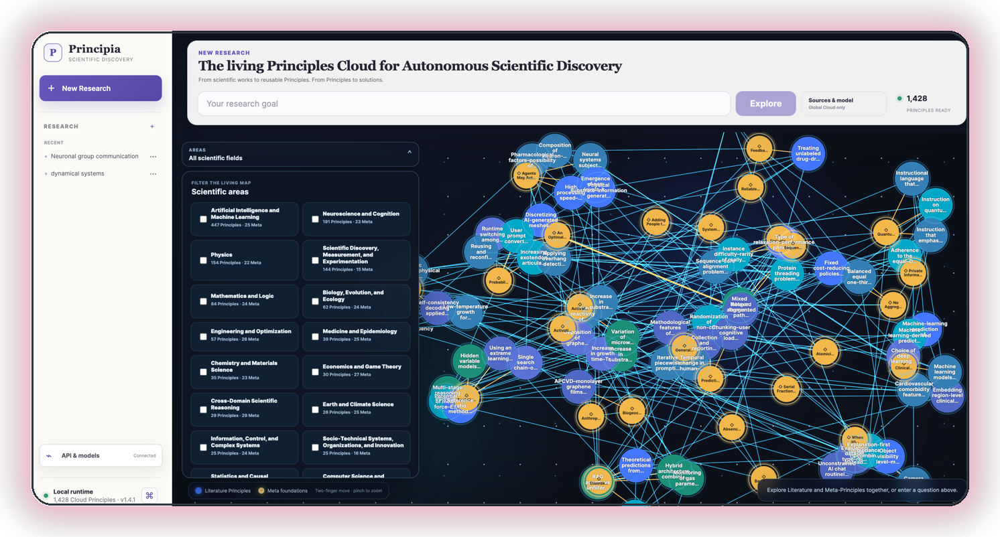
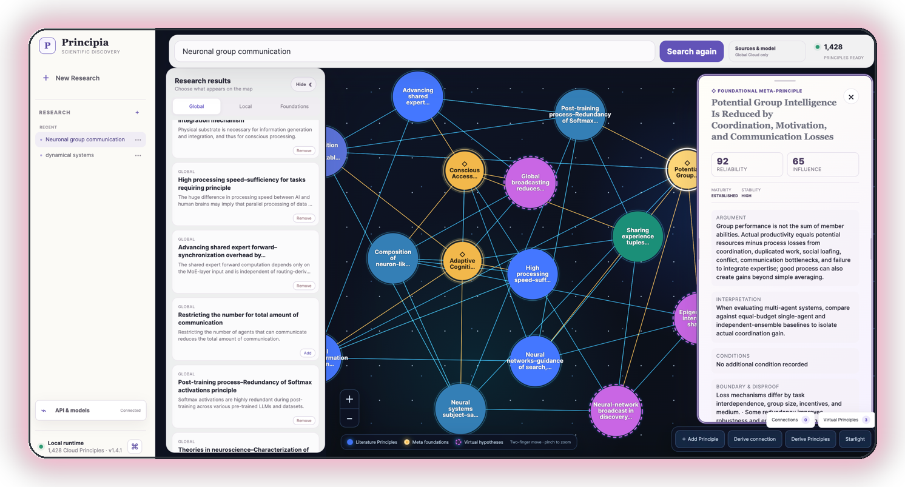

<div align="center">


# 🔬 Principia

**The living Principles Cloud for Autonomous Scientific Discovery**

*— forked from [pzqpzq/Principia](https://github.com/pzqpzq/Principia), with a terminal stats utility & a restyled page*

[](https://github.com/vincntlaw/Principia/network)
[](https://github.com/pzqpzq/Principia/stargazers)
[](https://pypi.org/project/principia-ai/)
[](https://www.python.org/)
[](LICENSE)
[](https://arxiv.org/abs/2606.29354)

[](https://discord.com/users/283333002749018113)

*The Discord card above is **live** — my real presence & activity via [Lanyard](https://github.com/Phineas/lanyard).*

</div>

---

> 🍴 **This is a fork.** All research, code and the Global Principles Cloud are the work of **[@pzqpzq](https://github.com/pzqpzq)** — the [upstream repository](https://github.com/pzqpzq/Principia) is the authoritative home for docs, issues and releases. This fork adds one independent utility (below), restyles this page, and changes **nothing** in upstream behavior.

## 🧪 What this fork adds

**`scripts/cloud_stats.py`** — inspect any Global Principles Cloud snapshot straight from the terminal. It counts every collection directly from the canonical JSONL shards (public metadata only — no local data, no credentials), so you don't need to open the app to see what's inside a snapshot.

```bash
# from anywhere inside the repository (auto-discovers global-cloud/)
python Principia-v1.4.1/core/scripts/cloud_stats.py

# or point at a cloud root explicitly / get machine-readable JSON
python scripts/cloud_stats.py --cloud-root /path/to/global-cloud --json
```

Real output against the current Cloud:

```
Principia Global Cloud - snapshot statistics
============================================
cloud root : .../global-cloud
version    : 2

v2 collections:
  collection                          records   shards   status
  -------------------------------------------------------------
  Works                                  1128      256   active 1128
  Literature Principles                  1531      256   active 1531
  Meta-Principles                         406      256   active 405, retired 1
  Principle relations                     468      256   active 35, proposed 432, retired 1
  Foundation links                        496      256   active 496
  Foundation assessments                 1531      256   -
  Foundation gaps                          30      256   open 30
  Principle-Work provenance              3328      256   -

v1 legacy: 233 works · 676 principles · 36 relations · 1295 provenance

total records      : 11158
active principles  : 1936
```

## ✨ What is Principia?

Principia turns scientific literature into an **inspectable reasoning substrate**. Instead of treating papers as the terminal unit of knowledge, it represents reusable mechanisms, constraints, trade-offs, boundary conditions and falsifiers as revisioned **Principles** — then lets researchers connect, ground and derive new ones.

> **Core thesis:** autonomous scientific discovery needs an intermediate scientific language between papers and hypotheses — one that preserves provenance, scope, uncertainty, and falsifiability.

```
scientific Works
      │  provenance
      ▼
literature Principles ──── typed relations ──── literature Principles
      │
      │  foundation assessment
      ▼
Meta-Principles
      │
      │  explicitly selected reasoning context
      ▼
virtual connections and derived Principles
      │
      ▼
validation, revision, or rejection
```

## 🌍 Global Principles Cloud (upstream v1.4.1 launch snapshot)

| | | | |
|---|---|---|---|
| **958** Works | **676** Literature Principles | **405** Active Meta-Principles | **1,081** Active Principles |
| **2,101** Provenance links | **468** Principle relations | **84** Foundation links | **676** Foundation assessments |

*The Cloud has grown since — run `cloud_stats.py` above for the live counts of your checkout.*

## 🔁 Workflow: retrieval → derivation

| **01 · Discover** | **02 · Inspect** | **03 · Derive** |
|---|---|---|
| Global retrieval finds relevant Works, expands them through explicit provenance, and ranks the resulting Principles. Optional local extraction runs only on folders you select. | A WebGL map distinguishes literature Principles, Meta-Principles and virtual hypotheses. A shared inspector exposes argument, conditions, boundaries, reliability, revisions and sources. | **Derive connection** creates removable candidate edges. **Derive Principles** performs multi-level reasoning over up to 20 selected records. |




## 🚀 Install

**v1.4.1 (from source):**

```bash
git clone https://github.com/vincntlaw/Principia.git
cd Principia

python -m venv .venv
source .venv/bin/activate
python -m pip install -e "./Principia-v1.4.1/core[local]"

principia open --working-directory ./principia-workspace
```

**v1.3.3 (stable PyPI):**

```bash
python -m pip install principia-ai==1.3.3
```

## 🙏 Credits & License

- Original project, research and maintenance: **[@pzqpzq](https://github.com/pzqpzq)** → [upstream repository](https://github.com/pzqpzq/Principia)
- Paper: [arXiv:2606.29354](https://arxiv.org/abs/2606.29354) · ICML 2026
- License: **MIT** (see [LICENSE](LICENSE))

<div align="center">

**[💬 Find me on Discord](https://discord.com/users/283333002749018113)** · fork restyled with ❤️

</div>
